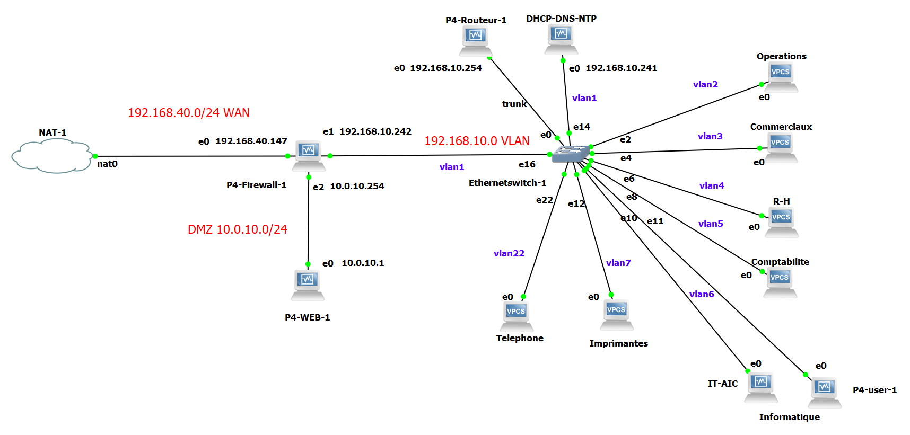

# P4_Infrastructure_PME
Victor DE FARIA 

novembre 2019

Projet de formation: Création de l'infrastructure d'une PME avec mise en place de sous-réseaux

- Définition des zones d’adressages VLAN, DMZ
- Installation des serveurs de routage, DHCP, DNS, NTP, WEB
- Règles firewall

### 3 serveurs : P4_DHCP, P4_Firewall, P4_Routeur ###

Valide l'utilisation de :

    Routage
    VLAN
    DHCP
    DNS
    NTP
    Serveur Web
    Serveur fichiers
    Firewall
